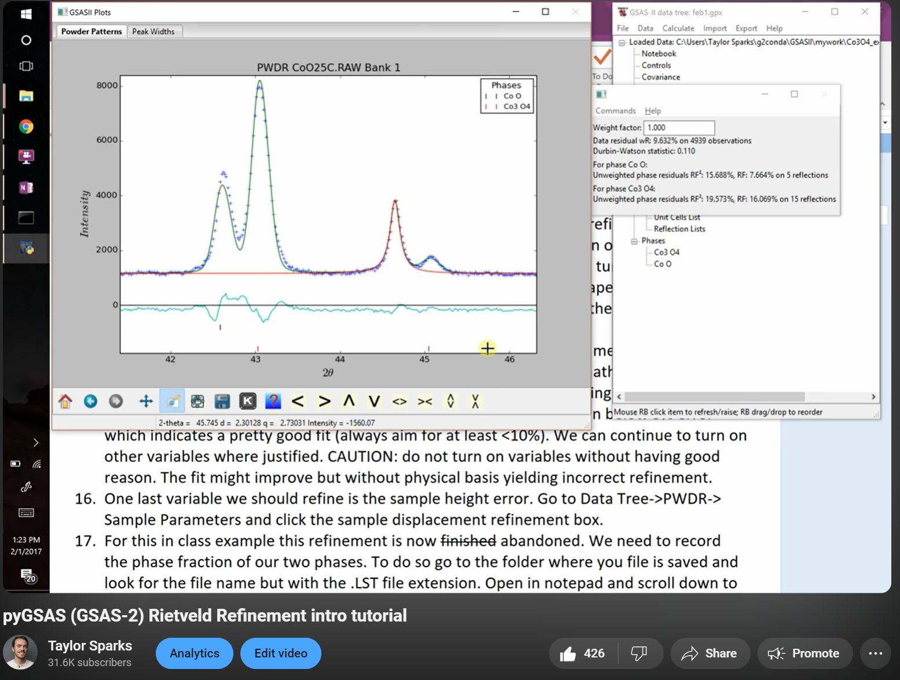
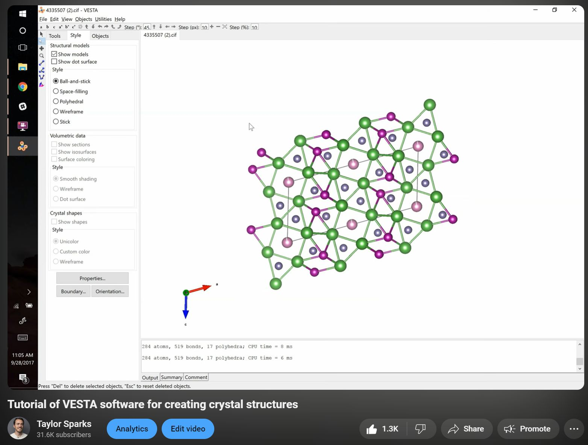
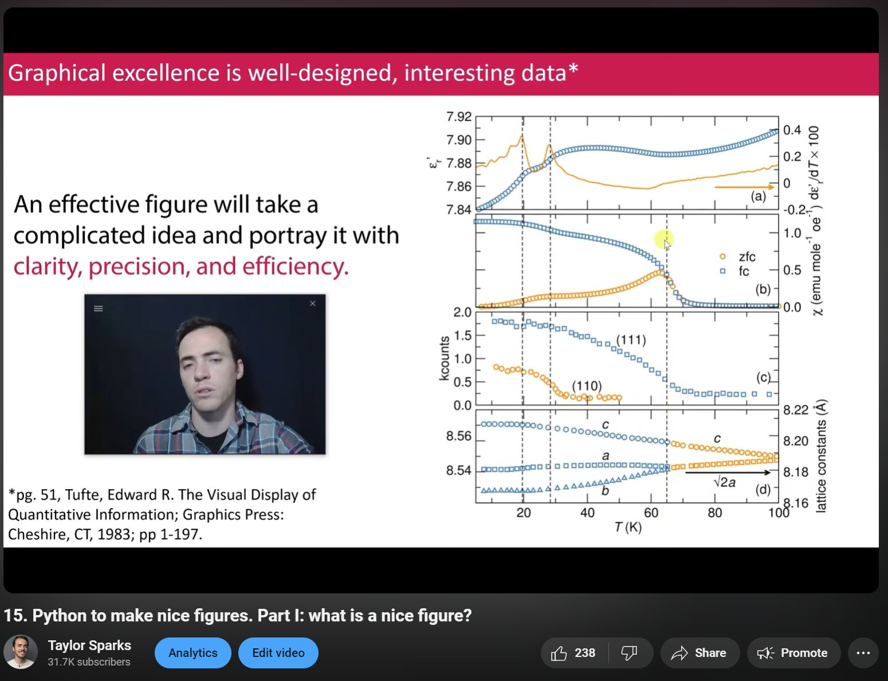

# Ceramic_Rietveld_Refinement
Software, data, and tools to accompany my American Ceramic Society workshop "Tools for Visualizing and Understanding the Structure of Crystalline Ceramics"
learn more at https://ceramics.org/professional-resources/career-development/short-courses/tools-for-visualizing-understanding-structure-of-crystalline-ceramics/

This repo has presentation slides (PDF), example files (powder diffraction data, cifs, etc) and some python tools for plotting and visualizing results.

Check out this YouTube tutorial video to follow along with the Co3O4 files in the examples folder
https://youtu.be/mcuLF0Szd4w?si=lqOMSefrIFVpTIpA

Check out this YouTube tutorial video to learn how to use VESTA
[https://youtu.be/mcuLF0Szd4w?si=lqOMSefrIFVpTIpA](https://youtu.be/F7d1YJa7KX4?si=EGCpikQKXjN6Xv_k)

Check out this YouTube video describing fundamentals of good vs bad figures in scientific communication!
[https://youtu.be/rUV8VFbUi_U?si=QkhBq8HLUNZ3ohHW](https://youtu.be/rUV8VFbUi_U?si=QkhBq8HLUNZ3ohHW)

